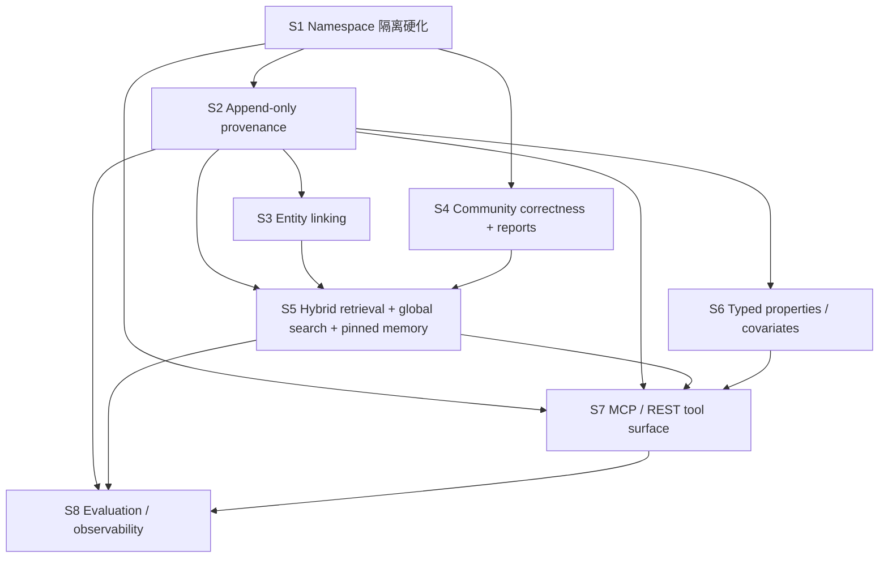

结论：这组问题不能按“逐条修 bug”的方式推进，应该拆成 8 个有依赖关系的 session。先做 `namespace` 隔离和 `append-only + provenance` 两个地基，再做 entity linking、community、retrieval、tool surface、evaluation。原因很直接：如果先优化 search 或 context loader，实际是在错误的身份模型和危险的写入模型上继续加复杂度，后面一定返工。

我按 superpowers 的 `writing-plans` 框架来组织，下面给的是可执行的实现方案，不是泛化建议。估算的 token 消耗口径是“本 session 需要读的代码 + 测试 + 指令上下文”，每个 session 都控制在 600k 以下。

**Session 概览**

| Session | 主题 | 预估上下文消耗 | 依赖 | 涉及模块 |
|---|---:|---:|---|---|
| S1 | Namespace 隔离硬化 | 140k | 无 | schema / engine / search / vec / community / tools / MCP / REST |
| S2 | Append-only provenance 写入模型 | 180k | S1 | schema / engine / extractor / import / context / backup |
| S3 | Entity linking 替代粗暴 merge | 150k | S1, S2 | consolidator / engine / extractor / tools |
| S4 | Community correctness + report layer | 120k | S1 | community / schema / tools |
| S5 | Query-aware hybrid retrieval + global search + pinned memory | 220k | S2, S3, S4 | search / context-loader / community / tools / MCP / REST |
| S6 | 半结构化图 schema：typed properties / covariates | 140k | S2 | schema / engine / extractor / import / export / backup / context |
| S7 | MCP / REST tool surface 增强 | 110k | S1, S2, S5, S6 | tools / MCP / REST / vec / schema / community |
| S8 | Evaluation / observability | 100k | S2, S5, S7 | events / retrieval / context / tools / REST / eval fixtures |

**Session 1：Namespace 隔离硬化**

目标：把 `namespace` 从“部分存在”升级为“强约束”，消灭跨 tenant 污染和假参数。

需要读取的文件：
- [src/host/graph-schema.ts](/Users/mi/Projects/openclaw-memory/.claude/worktrees/laughing-almeida-a4958c/src/host/graph-schema.ts)
- [src/host/graph-engine.ts](/Users/mi/Projects/openclaw-memory/.claude/worktrees/laughing-almeida-a4958c/src/host/graph-engine.ts)
- [src/host/graph-search.ts](/Users/mi/Projects/openclaw-memory/.claude/worktrees/laughing-almeida-a4958c/src/host/graph-search.ts)
- [src/host/graph-vec.ts](/Users/mi/Projects/openclaw-memory/.claude/worktrees/laughing-almeida-a4958c/src/host/graph-vec.ts)
- [src/host/graph-community.ts](/Users/mi/Projects/openclaw-memory/.claude/worktrees/laughing-almeida-a4958c/src/host/graph-community.ts)
- [src/host/graph-tools.ts](/Users/mi/Projects/openclaw-memory/.claude/worktrees/laughing-almeida-a4958c/src/host/graph-tools.ts)
- [src/host/graph-mcp.ts](/Users/mi/Projects/openclaw-memory/.claude/worktrees/laughing-almeida-a4958c/src/host/graph-mcp.ts)
- [src/host/graph-rest.ts](/Users/mi/Projects/openclaw-memory/.claude/worktrees/laughing-almeida-a4958c/src/host/graph-rest.ts)
- [src/__tests__/graph-engine.test.ts](/Users/mi/Projects/openclaw-memory/.claude/worktrees/laughing-almeida-a4958c/src/__tests__/graph-engine.test.ts)
- [src/__tests__/graph-search.test.ts](/Users/mi/Projects/openclaw-memory/.claude/worktrees/laughing-almeida-a4958c/src/__tests__/graph-search.test.ts)
- [src/__tests__/graph-community.test.ts](/Users/mi/Projects/openclaw-memory/.claude/worktrees/laughing-almeida-a4958c/src/__tests__/graph-community.test.ts)
- [src/__tests__/graph-tools.test.ts](/Users/mi/Projects/openclaw-memory/.claude/worktrees/laughing-almeida-a4958c/src/__tests__/graph-tools.test.ts)
- [src/__tests__/graph-mcp.test.ts](/Users/mi/Projects/openclaw-memory/.claude/worktrees/laughing-almeida-a4958c/src/__tests__/graph-mcp.test.ts)
- [src/__tests__/graph-rest.test.ts](/Users/mi/Projects/openclaw-memory/.claude/worktrees/laughing-almeida-a4958c/src/__tests__/graph-rest.test.ts)
- [src/__tests__/test-helpers.ts](/Users/mi/Projects/openclaw-memory/.claude/worktrees/laughing-almeida-a4958c/src/__tests__/test-helpers.ts)

需要修改的文件：
- [src/host/graph-schema.ts](/Users/mi/Projects/openclaw-memory/.claude/worktrees/laughing-almeida-a4958c/src/host/graph-schema.ts)
- [src/host/graph-engine.ts](/Users/mi/Projects/openclaw-memory/.claude/worktrees/laughing-almeida-a4958c/src/host/graph-engine.ts)
- [src/host/graph-search.ts](/Users/mi/Projects/openclaw-memory/.claude/worktrees/laughing-almeida-a4958c/src/host/graph-search.ts)
- [src/host/graph-vec.ts](/Users/mi/Projects/openclaw-memory/.claude/worktrees/laughing-almeida-a4958c/src/host/graph-vec.ts)
- [src/host/graph-community.ts](/Users/mi/Projects/openclaw-memory/.claude/worktrees/laughing-almeida-a4958c/src/host/graph-community.ts)
- [src/host/graph-tools.ts](/Users/mi/Projects/openclaw-memory/.claude/worktrees/laughing-almeida-a4958c/src/host/graph-tools.ts)
- [src/host/graph-mcp.ts](/Users/mi/Projects/openclaw-memory/.claude/worktrees/laughing-almeida-a4958c/src/host/graph-mcp.ts)
- [src/host/graph-rest.ts](/Users/mi/Projects/openclaw-memory/.claude/worktrees/laughing-almeida-a4958c/src/host/graph-rest.ts)
- [src/__tests__/graph-engine.test.ts](/Users/mi/Projects/openclaw-memory/.claude/worktrees/laughing-almeida-a4958c/src/__tests__/graph-engine.test.ts)
- [src/__tests__/graph-search.test.ts](/Users/mi/Projects/openclaw-memory/.claude/worktrees/laughing-almeida-a4958c/src/__tests__/graph-search.test.ts)
- [src/__tests__/graph-community.test.ts](/Users/mi/Projects/openclaw-memory/.claude/worktrees/laughing-almeida-a4958c/src/__tests__/graph-community.test.ts)
- [src/__tests__/graph-tools.test.ts](/Users/mi/Projects/openclaw-memory/.claude/worktrees/laughing-almeida-a4958c/src/__tests__/graph-tools.test.ts)
- [src/__tests__/graph-mcp.test.ts](/Users/mi/Projects/openclaw-memory/.claude/worktrees/laughing-almeida-a4958c/src/__tests__/graph-mcp.test.ts)
- [src/__tests__/graph-rest.test.ts](/Users/mi/Projects/openclaw-memory/.claude/worktrees/laughing-almeida-a4958c/src/__tests__/graph-rest.test.ts)

具体修改步骤：
1. 在 schema 层补齐 `entity_aliases / communities / community_members` 的 `namespace` 列和组合索引，统一索引形态为 `(namespace, <lookup_key>)`。
2. 重建 FTS 设计，不再只存 `id`。推荐方案是 FTS 表加 `namespace` 和 `type` 的非全文列；如果 SQLite FTS 迁移成本太高，就新建 `entities_fts_v2` 并做一次 rebuild。
3. 重构 vec 设计。优先方案是在 vec 侧增加 `namespace` 元数据并查询时过滤；如果 `vec0` 不支持有效过滤，就新增旁路 lookup 表，向量召回时 `overfetch -> namespace filter -> rerank`。
4. 在 `MemoryGraphEngine` 内抽一个统一的 scope helper，彻底移除 namespaced engine 上的 `OR namespace IS NULL` 漏洞。原则是：`namespace != null` 时只能看到本 namespace；`namespace == null` 时只能看到 `NULL namespace`。
5. 修补所有漏 scope 的查询：`findEntities`、alias lookup、`findEdges`、`getNeighbors`、`getEntityHistory`、`getEpisodes`、`stats`、`reassignEdges`、community 查询和 search fallback。
6. 明确 tool surface 的 namespace 语义。推荐做法是删除 `graph-tools.ts` 里无效的 `namespace?: string` 输入字段，改成“server/router 创建 scoped engine”；如果产品上必须 per-request namespace，则在 MCP/REST 边界做请求上下文绑定，不能只在 tool input 里留一个假参数。
7. 加双租户回归测试：同名 entity、alias、community、FTS、vec 查询都不得串 tenant。

成功标准：
- `S1-C1` schema 中 `entity_aliases / communities / community_members / FTS / vec lookup` 都具备 namespace 维度，迁移可重复执行。
- `S1-C2` namespaced engine 不再读取 `NULL namespace` 数据，双租户搜索和 detail 都只返回本 tenant 数据。
- `S1-C3` `graph-tools.ts` 不再存在“传了 namespace 但实际没生效”的接口语义，MCP/REST 测试覆盖这个约束。

风险和回退方案：
- FTS/vec 迁移最容易出兼容问题。回退方案是保留旧表只读一版，先引入 `*_v2` 新表和 rebuild 命令，确认一致后再切读路径。
- 如果历史库里混有 `NULL namespace` 旧数据，不要自动暴露给所有 tenant。回退策略应是“只对显式 migration job 做归属修复”，而不是查询时放宽条件。

**Session 2：Append-only provenance 写入模型**

目标：把 extractor 从“可直接毁掉历史”改成“只追加事实和证据，再做 supersession 决策”。

需要读取的文件：
- [src/host/graph-schema.ts](/Users/mi/Projects/openclaw-memory/.claude/worktrees/laughing-almeida-a4958c/src/host/graph-schema.ts)
- [src/host/graph-engine.ts](/Users/mi/Projects/openclaw-memory/.claude/worktrees/laughing-almeida-a4958c/src/host/graph-engine.ts)
- [src/host/graph-extractor.ts](/Users/mi/Projects/openclaw-memory/.claude/worktrees/laughing-almeida-a4958c/src/host/graph-extractor.ts)
- [src/host/graph-import.ts](/Users/mi/Projects/openclaw-memory/.claude/worktrees/laughing-almeida-a4958c/src/host/graph-import.ts)
- [src/host/graph-context-loader.ts](/Users/mi/Projects/openclaw-memory/.claude/worktrees/laughing-almeida-a4958c/src/host/graph-context-loader.ts)
- [src/host/graph-backup.ts](/Users/mi/Projects/openclaw-memory/.claude/worktrees/laughing-almeida-a4958c/src/host/graph-backup.ts)
- [src/host/graph-parsers.ts](/Users/mi/Projects/openclaw-memory/.claude/worktrees/laughing-almeida-a4958c/src/host/graph-parsers.ts)
- [src/__tests__/graph-extractor.test.ts](/Users/mi/Projects/openclaw-memory/.claude/worktrees/laughing-almeida-a4958c/src/__tests__/graph-extractor.test.ts)
- [src/__tests__/graph-context-loader.test.ts](/Users/mi/Projects/openclaw-memory/.claude/worktrees/laughing-almeida-a4958c/src/__tests__/graph-context-loader.test.ts)
- [src/__tests__/graph-import.test.ts](/Users/mi/Projects/openclaw-memory/.claude/worktrees/laughing-almeida-a4958c/src/__tests__/graph-import.test.ts)
- [src/__tests__/graph-backup.test.ts](/Users/mi/Projects/openclaw-memory/.claude/worktrees/laughing-almeida-a4958c/src/__tests__/graph-backup.test.ts)

需要修改的文件：
- [src/host/graph-schema.ts](/Users/mi/Projects/openclaw-memory/.claude/worktrees/laughing-almeida-a4958c/src/host/graph-schema.ts)
- [新增 src/host/graph-provenance.ts](/Users/mi/Projects/openclaw-memory/.claude/worktrees/laughing-almeida-a4958c/src/host/graph-provenance.ts)
- [src/host/graph-engine.ts](/Users/mi/Projects/openclaw-memory/.claude/worktrees/laughing-almeida-a4958c/src/host/graph-engine.ts)
- [src/host/graph-extractor.ts](/Users/mi/Projects/openclaw-memory/.claude/worktrees/laughing-almeida-a4958c/src/host/graph-extractor.ts)
- [src/host/graph-import.ts](/Users/mi/Projects/openclaw-memory/.claude/worktrees/laughing-almeida-a4958c/src/host/graph-import.ts)
- [src/host/graph-context-loader.ts](/Users/mi/Projects/openclaw-memory/.claude/worktrees/laughing-almeida-a4958c/src/host/graph-context-loader.ts)
- [src/host/graph-backup.ts](/Users/mi/Projects/openclaw-memory/.claude/worktrees/laughing-almeida-a4958c/src/host/graph-backup.ts)
- [src/__tests__/graph-extractor.test.ts](/Users/mi/Projects/openclaw-memory/.claude/worktrees/laughing-almeida-a4958c/src/__tests__/graph-extractor.test.ts)
- [src/__tests__/graph-context-loader.test.ts](/Users/mi/Projects/openclaw-memory/.claude/worktrees/laughing-almeida-a4958c/src/__tests__/graph-context-loader.test.ts)
- [src/__tests__/graph-import.test.ts](/Users/mi/Projects/openclaw-memory/.claude/worktrees/laughing-almeida-a4958c/src/__tests__/graph-import.test.ts)
- [src/__tests__/graph-backup.test.ts](/Users/mi/Projects/openclaw-memory/.claude/worktrees/laughing-almeida-a4958c/src/__tests__/graph-backup.test.ts)
- [新增 src/__tests__/graph-provenance.test.ts](/Users/mi/Projects/openclaw-memory/.claude/worktrees/laughing-almeida-a4958c/src/__tests__/graph-provenance.test.ts)

具体修改步骤：
1. 新增 provenance 相关表，最少包括：`episode_text_units`、`entity_mentions`、`fact_assertions`、`supersession_proposals`。字段必须带 `episode_id / turn_index / speaker / start_offset / end_offset / namespace / evidence_unit_ids`。
2. 改造 `recordEpisode`，从只存整段 transcript，变成“episode + text units”双层写入。text unit 粒度建议是 turn 或 speaker segment，不要求一开始就做到 sentence。
3. 改 extractor 返回结构：`invalidations` 不再直接触发 `invalidateEntity`，而是产出 `supersession_proposals`，并绑定证据 unit。
4. 写入路径改成 append-only：新事实生成 assertion，新旧事实关系用 `challenged / superseded / confirmed` 状态机管理，不能在单次 LLM 输出后永久删除旧事实。
5. 更新 context loader，L2 详情和 search evidence packing 都可以回溯到 `speaker + turn + offset`，至少能展示到 text unit 级别。
6. 修改 import / backup，使新表可以导入、导出、恢复；否则一旦切新模型，备份不可用。

成功标准：
- `S2-C1` extractor 不再直接失效旧记忆；矛盾信息只能生成 proposal，不会单次写入后永久污染历史。
- `S2-C2` 每条新写入的事实都能追溯到 `episode -> text unit -> offset/speaker/turn`。
- `S2-C3` backup / restore / import 后，provenance 链条不丢失，context loader 能展示证据来源。

风险和回退方案：
- 让 LLM 直接给精确 offset 风险较高。回退方案是第一版只要求绑定 `text_unit_id`，offset 用 deterministic substring match 补，不把 offset 正确性当硬依赖。
- 旧接口如果还依赖 `invalidated` 计数，先保留字段但改语义为“proposal created / proposal applied”，避免一次性改断调用方。

**Session 3：Entity linking 替代粗暴 merge**

目标：把 consolidation 的“同名即合并”改成 explainable、可控的 entity linking。

需要读取的文件：
- [src/host/graph-consolidator.ts](/Users/mi/Projects/openclaw-memory/.claude/worktrees/laughing-almeida-a4958c/src/host/graph-consolidator.ts)
- [src/host/graph-engine.ts](/Users/mi/Projects/openclaw-memory/.claude/worktrees/laughing-almeida-a4958c/src/host/graph-engine.ts)
- [src/host/graph-extractor.ts](/Users/mi/Projects/openclaw-memory/.claude/worktrees/laughing-almeida-a4958c/src/host/graph-extractor.ts)
- [src/host/graph-tools.ts](/Users/mi/Projects/openclaw-memory/.claude/worktrees/laughing-almeida-a4958c/src/host/graph-tools.ts)
- [src/host/graph-schema.ts](/Users/mi/Projects/openclaw-memory/.claude/worktrees/laughing-almeida-a4958c/src/host/graph-schema.ts)
- [src/__tests__/graph-consolidator.test.ts](/Users/mi/Projects/openclaw-memory/.claude/worktrees/laughing-almeida-a4958c/src/__tests__/graph-consolidator.test.ts)
- [src/__tests__/graph-extractor.test.ts](/Users/mi/Projects/openclaw-memory/.claude/worktrees/laughing-almeida-a4958c/src/__tests__/graph-extractor.test.ts)
- [src/__tests__/graph-tools.test.ts](/Users/mi/Projects/openclaw-memory/.claude/worktrees/laughing-almeida-a4958c/src/__tests__/graph-tools.test.ts)

需要修改的文件：
- [新增 src/host/graph-linking.ts](/Users/mi/Projects/openclaw-memory/.claude/worktrees/laughing-almeida-a4958c/src/host/graph-linking.ts)
- [src/host/graph-consolidator.ts](/Users/mi/Projects/openclaw-memory/.claude/worktrees/laughing-almeida-a4958c/src/host/graph-consolidator.ts)
- [src/host/graph-engine.ts](/Users/mi/Projects/openclaw-memory/.claude/worktrees/laughing-almeida-a4958c/src/host/graph-engine.ts)
- [src/host/graph-tools.ts](/Users/mi/Projects/openclaw-memory/.claude/worktrees/laughing-almeida-a4958c/src/host/graph-tools.ts)
- [src/host/graph-schema.ts](/Users/mi/Projects/openclaw-memory/.claude/worktrees/laughing-almeida-a4958c/src/host/graph-schema.ts)
- [src/__tests__/graph-consolidator.test.ts](/Users/mi/Projects/openclaw-memory/.claude/worktrees/laughing-almeida-a4958c/src/__tests__/graph-consolidator.test.ts)
- [src/__tests__/graph-tools.test.ts](/Users/mi/Projects/openclaw-memory/.claude/worktrees/laughing-almeida-a4958c/src/__tests__/graph-tools.test.ts)
- [新增 src/__tests__/graph-linking.test.ts](/Users/mi/Projects/openclaw-memory/.claude/worktrees/laughing-almeida-a4958c/src/__tests__/graph-linking.test.ts)

具体修改步骤：
1. 新建 linker 模块，拆成三个阶段：candidate generation、feature scoring、decision。特征至少包括：规范名命中、alias 命中、type 兼容性、embedding 相似度、共享邻居、共享 provenance。
2. 定义 type compatibility matrix。默认规则必须保守：跨 type 的同名实体默认 `distinct`，只有显式兼容组合才允许进入 `same_as` 候选。
3. consolidation 不再按 `normalizeEntityName` 分桶直接 merge，而是调用 linker，拿到 `same_as / alias_of / possibly_same_as / distinct` 决策。
4. 只有高置信 `same_as` 才能触发 canonical merge；且 merge 后 loser 仍保留 link / alias / provenance，不是简单软删除。
5. `dryRun` 输出要升级为 explainable report，至少展示 `decision + score + top evidence`，便于评审和后续 MCP review flow。

成功标准：
- `S3-C1` 同名跨 type 实体默认不再自动 merge。
- `S3-C2` 只有高置信 `same_as` 才会触发 merge，且每次 merge 都有可解释 evidence。
- `S3-C3` consolidation 的 dry-run 和实际执行都能保住 edge/provenance，不会因 merge 造成关系丢失。

风险和回退方案：
- linker 很容易一上来做太重。回退方案是 v1 先用 deterministic scorer，不依赖 LLM；后续再把 model-based rerank 接进去。
- 如果 merge 正确率短期内无法验证，先把 auto-merge 关掉，只保留 `same_as proposal` 和人工确认链路。

**Session 4：Community correctness + report layer**

目标：先修 community correctness，再把 community 变成可被 retrieval 消费的一层资产。

需要读取的文件：
- [src/host/graph-community.ts](/Users/mi/Projects/openclaw-memory/.claude/worktrees/laughing-almeida-a4958c/src/host/graph-community.ts)
- [src/host/graph-schema.ts](/Users/mi/Projects/openclaw-memory/.claude/worktrees/laughing-almeida-a4958c/src/host/graph-schema.ts)
- [src/host/graph-engine.ts](/Users/mi/Projects/openclaw-memory/.claude/worktrees/laughing-almeida-a4958c/src/host/graph-engine.ts)
- [src/host/graph-tools.ts](/Users/mi/Projects/openclaw-memory/.claude/worktrees/laughing-almeida-a4958c/src/host/graph-tools.ts)
- [src/__tests__/graph-community.test.ts](/Users/mi/Projects/openclaw-memory/.claude/worktrees/laughing-almeida-a4958c/src/__tests__/graph-community.test.ts)
- [src/__tests__/graph-tools.test.ts](/Users/mi/Projects/openclaw-memory/.claude/worktrees/laughing-almeida-a4958c/src/__tests__/graph-tools.test.ts)

需要修改的文件：
- [src/host/graph-community.ts](/Users/mi/Projects/openclaw-memory/.claude/worktrees/laughing-almeida-a4958c/src/host/graph-community.ts)
- [src/host/graph-schema.ts](/Users/mi/Projects/openclaw-memory/.claude/worktrees/laughing-almeida-a4958c/src/host/graph-schema.ts)
- [src/host/graph-tools.ts](/Users/mi/Projects/openclaw-memory/.claude/worktrees/laughing-almeida-a4958c/src/host/graph-tools.ts)
- [src/__tests__/graph-community.test.ts](/Users/mi/Projects/openclaw-memory/.claude/worktrees/laughing-almeida-a4958c/src/__tests__/graph-community.test.ts)
- [src/__tests__/graph-tools.test.ts](/Users/mi/Projects/openclaw-memory/.claude/worktrees/laughing-almeida-a4958c/src/__tests__/graph-tools.test.ts)

具体修改步骤：
1. 修 BFS 逻辑。`maxCommunitySize` 达上限时，不能提前把未真正纳入 component 的邻居标记为 visited。推荐改成“组件完整遍历，存储时再做 report/truncation”。
2. 把 community 的所有读写和 DELETE 改成 namespace-scoped，严禁 `DELETE FROM communities` 这种全表清理。
3. 扩展 community 存储结构，除了 `label` 之外，增加 `report_summary / representative_entity_ids / report_updated_at` 之类字段，给 retrieval 使用。
4. `summarizeCommunities` 不只产 2-5 词标签，而是产检索友好的摘要文本，后续能进入 global search。
5. 补测试：`maxCommunitySize` 边界、多租户重跑不互删、report 存在且可读。

成功标准：
- `S4-C1` `maxCommunitySize` 不再导致 component 丢成员。
- `S4-C2` tenant A 重建 community 不会删 tenant B 的结果。
- `S4-C3` community 除 label 外还有可检索 report 文本，可供后续 search 使用。

风险和回退方案：
- community report 如果同步生成会拖慢 rebuild。回退方案是先同步写结构化 placeholder，再异步补 LLM report。
- 如果当前 connected-components 粒度过粗，先不引入复杂社区算法，先把 correctness 和 report layer 做稳。

**Session 5：Query-aware hybrid retrieval + global search + pinned memory**

目标：把 retrieval 升级成四段式 pipeline，并把 community 与 pinned core memory 正式纳入检索闭环。

需要读取的文件：
- [src/host/graph-search.ts](/Users/mi/Projects/openclaw-memory/.claude/worktrees/laughing-almeida-a4958c/src/host/graph-search.ts)
- [src/host/graph-context-loader.ts](/Users/mi/Projects/openclaw-memory/.claude/worktrees/laughing-almeida-a4958c/src/host/graph-context-loader.ts)
- [src/host/graph-community.ts](/Users/mi/Projects/openclaw-memory/.claude/worktrees/laughing-almeida-a4958c/src/host/graph-community.ts)
- [src/host/graph-engine.ts](/Users/mi/Projects/openclaw-memory/.claude/worktrees/laughing-almeida-a4958c/src/host/graph-engine.ts)
- [src/host/graph-tools.ts](/Users/mi/Projects/openclaw-memory/.claude/worktrees/laughing-almeida-a4958c/src/host/graph-tools.ts)
- [src/host/graph-mcp.ts](/Users/mi/Projects/openclaw-memory/.claude/worktrees/laughing-almeida-a4958c/src/host/graph-mcp.ts)
- [src/host/graph-rest.ts](/Users/mi/Projects/openclaw-memory/.claude/worktrees/laughing-almeida-a4958c/src/host/graph-rest.ts)
- [src/__tests__/graph-search.test.ts](/Users/mi/Projects/openclaw-memory/.claude/worktrees/laughing-almeida-a4958c/src/__tests__/graph-search.test.ts)
- [src/__tests__/graph-context-loader.test.ts](/Users/mi/Projects/openclaw-memory/.claude/worktrees/laughing-almeida-a4958c/src/__tests__/graph-context-loader.test.ts)
- [src/__tests__/graph-tools.test.ts](/Users/mi/Projects/openclaw-memory/.claude/worktrees/laughing-almeida-a4958c/src/__tests__/graph-tools.test.ts)
- [src/__tests__/graph-mcp.test.ts](/Users/mi/Projects/openclaw-memory/.claude/worktrees/laughing-almeida-a4958c/src/__tests__/graph-mcp.test.ts)
- [src/__tests__/graph-rest.test.ts](/Users/mi/Projects/openclaw-memory/.claude/worktrees/laughing-almeida-a4958c/src/__tests__/graph-rest.test.ts)

需要修改的文件：
- [新增 src/host/graph-retrieval.ts](/Users/mi/Projects/openclaw-memory/.claude/worktrees/laughing-almeida-a4958c/src/host/graph-retrieval.ts)
- [src/host/graph-search.ts](/Users/mi/Projects/openclaw-memory/.claude/worktrees/laughing-almeida-a4958c/src/host/graph-search.ts)
- [src/host/graph-context-loader.ts](/Users/mi/Projects/openclaw-memory/.claude/worktrees/laughing-almeida-a4958c/src/host/graph-context-loader.ts)
- [src/host/graph-tools.ts](/Users/mi/Projects/openclaw-memory/.claude/worktrees/laughing-almeida-a4958c/src/host/graph-tools.ts)
- [src/host/graph-mcp.ts](/Users/mi/Projects/openclaw-memory/.claude/worktrees/laughing-almeida-a4958c/src/host/graph-mcp.ts)
- [src/host/graph-rest.ts](/Users/mi/Projects/openclaw-memory/.claude/worktrees/laughing-almeida-a4958c/src/host/graph-rest.ts)
- [src/__tests__/graph-search.test.ts](/Users/mi/Projects/openclaw-memory/.claude/worktrees/laughing-almeida-a4958c/src/__tests__/graph-search.test.ts)
- [src/__tests__/graph-context-loader.test.ts](/Users/mi/Projects/openclaw-memory/.claude/worktrees/laughing-almeida-a4958c/src/__tests__/graph-context-loader.test.ts)
- [src/__tests__/graph-tools.test.ts](/Users/mi/Projects/openclaw-memory/.claude/worktrees/laughing-almeida-a4958c/src/__tests__/graph-tools.test.ts)
- [新增 src/__tests__/graph-retrieval.test.ts](/Users/mi/Projects/openclaw-memory/.claude/worktrees/laughing-almeida-a4958c/src/__tests__/graph-retrieval.test.ts)

具体修改步骤：
1. 新建 retrieval orchestration 层，不再让 `graph-search.ts` 一文件同时承担 candidate generation、scoring、packing。
2. 实现四段式 pipeline。
3. `query extraction`：把 query 解析成 entity hints、relation intent、时间线索、identity/preference/constraint intent、broad vs focused mode。
4. `multi-signal retrieval`：并行拉取 entity FTS、vec、alias、graph neighborhood、recent text units、community reports、pinned core memory。
5. `focal-node rerank`：用规则特征或轻量 rerank 选 focal entity / focal community，避免简单按单点 score 排序。
6. `evidence packing`：把 focal node、本地邻域、支持性 text units、community report、冲突事实一起装入 L1/L2，严格按 token budget 裁剪。
7. 加 global search 路径。宽查询优先从 community report 开始，做 map/reduce，再落到 member entities；窄查询仍优先 entity mode。
8. 改 context loader，新增 pinned core memory 层，常驻注入身份、偏好、长期约束；L1/L2 则 query-driven。
9. 更新 MCP / REST / tool 输出，显式暴露 `searchMode`、`scoreBreakdown`、`evidenceIds`。

成功标准：
- `S5-C1` retrieval pipeline 具备 `query extraction -> multi-signal retrieval -> focal rerank -> evidence packing` 四个显式阶段。
- `S5-C2` broad query 能走 community/global path，focused query 能走 entity path，并且结果可解释。
- `S5-C3` context loader 总是包含 pinned core memory，且 L1/L2 不超预算。

风险和回退方案：
- 这是最容易复杂度失控的 session。回退策略是保留 `entity` 旧模式，用 feature flag 逐步放开 `mixed` 和 `global`。
- 如果 rerank 模型效果不稳定，先上 deterministic rerank，保住 explainability 和可测试性。

**Session 6：半结构化图 schema：typed properties / covariates**

目标：把“全塞 summary”升级成“summary + typed properties”双轨结构，支撑更稳的 identity / preference / constraint 表达。

需要读取的文件：
- [src/host/graph-schema.ts](/Users/mi/Projects/openclaw-memory/.claude/worktrees/laughing-almeida-a4958c/src/host/graph-schema.ts)
- [src/host/graph-engine.ts](/Users/mi/Projects/openclaw-memory/.claude/worktrees/laughing-almeida-a4958c/src/host/graph-engine.ts)
- [src/host/graph-extractor.ts](/Users/mi/Projects/openclaw-memory/.claude/worktrees/laughing-almeida-a4958c/src/host/graph-extractor.ts)
- [src/host/graph-import.ts](/Users/mi/Projects/openclaw-memory/.claude/worktrees/laughing-almeida-a4958c/src/host/graph-import.ts)
- [src/host/graph-export.ts](/Users/mi/Projects/openclaw-memory/.claude/worktrees/laughing-almeida-a4958c/src/host/graph-export.ts)
- [src/host/graph-backup.ts](/Users/mi/Projects/openclaw-memory/.claude/worktrees/laughing-almeida-a4958c/src/host/graph-backup.ts)
- [src/host/graph-context-loader.ts](/Users/mi/Projects/openclaw-memory/.claude/worktrees/laughing-almeida-a4958c/src/host/graph-context-loader.ts)
- [src/__tests__/graph-engine.test.ts](/Users/mi/Projects/openclaw-memory/.claude/worktrees/laughing-almeida-a4958c/src/__tests__/graph-engine.test.ts)
- [src/__tests__/graph-extractor.test.ts](/Users/mi/Projects/openclaw-memory/.claude/worktrees/laughing-almeida-a4958c/src/__tests__/graph-extractor.test.ts)
- [src/__tests__/graph-import.test.ts](/Users/mi/Projects/openclaw-memory/.claude/worktrees/laughing-almeida-a4958c/src/__tests__/graph-import.test.ts)
- [src/__tests__/graph-export.test.ts](/Users/mi/Projects/openclaw-memory/.claude/worktrees/laughing-almeida-a4958c/src/__tests__/graph-export.test.ts)
- [src/__tests__/graph-backup.test.ts](/Users/mi/Projects/openclaw-memory/.claude/worktrees/laughing-almeida-a4958c/src/__tests__/graph-backup.test.ts)
- [src/__tests__/graph-context-loader.test.ts](/Users/mi/Projects/openclaw-memory/.claude/worktrees/laughing-almeida-a4958c/src/__tests__/graph-context-loader.test.ts)

需要修改的文件：
- [新增 src/host/graph-properties.ts](/Users/mi/Projects/openclaw-memory/.claude/worktrees/laughing-almeida-a4958c/src/host/graph-properties.ts)
- [src/host/graph-schema.ts](/Users/mi/Projects/openclaw-memory/.claude/worktrees/laughing-almeida-a4958c/src/host/graph-schema.ts)
- [src/host/graph-engine.ts](/Users/mi/Projects/openclaw-memory/.claude/worktrees/laughing-almeida-a4958c/src/host/graph-engine.ts)
- [src/host/graph-extractor.ts](/Users/mi/Projects/openclaw-memory/.claude/worktrees/laughing-almeida-a4958c/src/host/graph-extractor.ts)
- [src/host/graph-import.ts](/Users/mi/Projects/openclaw-memory/.claude/worktrees/laughing-almeida-a4958c/src/host/graph-import.ts)
- [src/host/graph-export.ts](/Users/mi/Projects/openclaw-memory/.claude/worktrees/laughing-almeida-a4958c/src/host/graph-export.ts)
- [src/host/graph-backup.ts](/Users/mi/Projects/openclaw-memory/.claude/worktrees/laughing-almeida-a4958c/src/host/graph-backup.ts)
- [src/host/graph-context-loader.ts](/Users/mi/Projects/openclaw-memory/.claude/worktrees/laughing-almeida-a4958c/src/host/graph-context-loader.ts)
- [src/__tests__/graph-engine.test.ts](/Users/mi/Projects/openclaw-memory/.claude/worktrees/laughing-almeida-a4958c/src/__tests__/graph-engine.test.ts)
- [src/__tests__/graph-extractor.test.ts](/Users/mi/Projects/openclaw-memory/.claude/worktrees/laughing-almeida-a4958c/src/__tests__/graph-extractor.test.ts)
- [src/__tests__/graph-import.test.ts](/Users/mi/Projects/openclaw-memory/.claude/worktrees/laughing-almeida-a4958c/src/__tests__/graph-import.test.ts)
- [src/__tests__/graph-export.test.ts](/Users/mi/Projects/openclaw-memory/.claude/worktrees/laughing-almeida-a4958c/src/__tests__/graph-export.test.ts)
- [src/__tests__/graph-backup.test.ts](/Users/mi/Projects/openclaw-memory/.claude/worktrees/laughing-almeida-a4958c/src/__tests__/graph-backup.test.ts)
- [src/__tests__/graph-context-loader.test.ts](/Users/mi/Projects/openclaw-memory/.claude/worktrees/laughing-almeida-a4958c/src/__tests__/graph-context-loader.test.ts)

具体修改步骤：
1. 新增 `entity_properties` 和必要的 `property_observations / covariates` 结构，支持标量类型、时间范围、来源 evidence。
2. 在 engine 暴露 typed property API，例如 `setEntityProperty / listEntityProperties / getEffectiveProperties`。
3. extractor 把稳定结构字段从 summary 中抽出来，至少覆盖 `identity / preference / constraint / role / location / timeframe` 这些高频记忆类型。
4. export / import / backup 全链路支持新结构，确保 typed properties 可以 round-trip。
5. context loader 让 pinned core memory 和 detail view 能优先读 typed properties，summary 退化成展示层。

成功标准：
- `S6-C1` 至少一类核心记忆可以用 typed properties 表达并查询，不再只能靠 summary 文本。
- `S6-C2` import / export / backup 不丢失 typed properties 和 covariates。
- `S6-C3` context loader 能消费 typed properties，身份/偏好/约束展示稳定。

风险和回退方案：
- schema 容易膨胀。回退方案是 v1 只支持 whitelist key 和 scalar value，不在第一版做任意 JSON schema。
- 如果 extractor 结构化抽取不稳定，先允许“property candidate + evidence”模式，人工确认后再升格成 effective property。

**Session 7：MCP / REST tool surface 增强**

目标：把新能力做成可操作接口，包括 episode management、index rebuild、search mode 切换和 review flow。

需要读取的文件：
- [src/host/graph-tools.ts](/Users/mi/Projects/openclaw-memory/.claude/worktrees/laughing-almeida-a4958c/src/host/graph-tools.ts)
- [src/host/graph-mcp.ts](/Users/mi/Projects/openclaw-memory/.claude/worktrees/laughing-almeida-a4958c/src/host/graph-mcp.ts)
- [src/host/graph-rest.ts](/Users/mi/Projects/openclaw-memory/.claude/worktrees/laughing-almeida-a4958c/src/host/graph-rest.ts)
- [src/host/graph-schema.ts](/Users/mi/Projects/openclaw-memory/.claude/worktrees/laughing-almeida-a4958c/src/host/graph-schema.ts)
- [src/host/graph-vec.ts](/Users/mi/Projects/openclaw-memory/.claude/worktrees/laughing-almeida-a4958c/src/host/graph-vec.ts)
- [src/host/graph-community.ts](/Users/mi/Projects/openclaw-memory/.claude/worktrees/laughing-almeida-a4958c/src/host/graph-community.ts)
- [src/__tests__/graph-tools.test.ts](/Users/mi/Projects/openclaw-memory/.claude/worktrees/laughing-almeida-a4958c/src/__tests__/graph-tools.test.ts)
- [src/__tests__/graph-mcp.test.ts](/Users/mi/Projects/openclaw-memory/.claude/worktrees/laughing-almeida-a4958c/src/__tests__/graph-mcp.test.ts)
- [src/__tests__/graph-rest.test.ts](/Users/mi/Projects/openclaw-memory/.claude/worktrees/laughing-almeida-a4958c/src/__tests__/graph-rest.test.ts)

需要修改的文件：
- [src/host/graph-tools.ts](/Users/mi/Projects/openclaw-memory/.claude/worktrees/laughing-almeida-a4958c/src/host/graph-tools.ts)
- [src/host/graph-mcp.ts](/Users/mi/Projects/openclaw-memory/.claude/worktrees/laughing-almeida-a4958c/src/host/graph-mcp.ts)
- [src/host/graph-rest.ts](/Users/mi/Projects/openclaw-memory/.claude/worktrees/laughing-almeida-a4958c/src/host/graph-rest.ts)
- [src/host/graph-schema.ts](/Users/mi/Projects/openclaw-memory/.claude/worktrees/laughing-almeida-a4958c/src/host/graph-schema.ts)
- [src/host/graph-vec.ts](/Users/mi/Projects/openclaw-memory/.claude/worktrees/laughing-almeida-a4958c/src/host/graph-vec.ts)
- [src/host/graph-community.ts](/Users/mi/Projects/openclaw-memory/.claude/worktrees/laughing-almeida-a4958c/src/host/graph-community.ts)
- [src/__tests__/graph-tools.test.ts](/Users/mi/Projects/openclaw-memory/.claude/worktrees/laughing-almeida-a4958c/src/__tests__/graph-tools.test.ts)
- [src/__tests__/graph-mcp.test.ts](/Users/mi/Projects/openclaw-memory/.claude/worktrees/laughing-almeida-a4958c/src/__tests__/graph-mcp.test.ts)
- [src/__tests__/graph-rest.test.ts](/Users/mi/Projects/openclaw-memory/.claude/worktrees/laughing-almeida-a4958c/src/__tests__/graph-rest.test.ts)

具体修改步骤：
1. 增加 episode 相关接口：列 session、取 episode 详情、查看 text units、查看 assertion/proposal 证据。
2. 增加 operational 接口：FTS rebuild、vec rebuild、community rebuild、linking dry-run、consolidation dry-run。
3. 增加 search mode 切换：`entity / global / mixed / debug`，debug mode 返回 score breakdown 和 evidence ids。
4. 增加 supersession review 接口：approve / reject proposal，要求显式 proposal id 和 reason。
5. 清理所有 destructive tool 的默认行为，必须显式传 target 和 reason；不再有“一句话就 invalidate”的隐含写入。

成功标准：
- `S7-C1` MCP / REST 都能做 episode management、index rebuild、search mode 切换。
- `S7-C2` supersession / invalidate 这类高风险操作都有显式 target、reason，支持 dry-run 或 review state。
- `S7-C3` tool contract 中 namespace 和 search mode 语义清晰，测试覆盖。

风险和回退方案：
- 工具面一旦铺太大，调用方会用错。回退策略是第一版默认只开放 read-only + rebuild，review/mutate 接口挂 `experimental`。
- rebuild 接口容易被滥用。回退方案是在 REST 层加最小限流，MCP 层只给管理员配置暴露。

**Session 8：Evaluation / observability**

目标：让“写入是否正确、检索是否有效、上下文是否浪费”都可以持续测量。

需要读取的文件：
- [src/host/graph-events.ts](/Users/mi/Projects/openclaw-memory/.claude/worktrees/laughing-almeida-a4958c/src/host/graph-events.ts)
- [src/host/graph-search.ts](/Users/mi/Projects/openclaw-memory/.claude/worktrees/laughing-almeida-a4958c/src/host/graph-search.ts)
- [src/host/graph-context-loader.ts](/Users/mi/Projects/openclaw-memory/.claude/worktrees/laughing-almeida-a4958c/src/host/graph-context-loader.ts)
- [src/host/graph-tools.ts](/Users/mi/Projects/openclaw-memory/.claude/worktrees/laughing-almeida-a4958c/src/host/graph-tools.ts)
- [src/host/graph-rest.ts](/Users/mi/Projects/openclaw-memory/.claude/worktrees/laughing-almeida-a4958c/src/host/graph-rest.ts)
- [src/host/graph-extractor.ts](/Users/mi/Projects/openclaw-memory/.claude/worktrees/laughing-almeida-a4958c/src/host/graph-extractor.ts)
- [package.json](/Users/mi/Projects/openclaw-memory/.claude/worktrees/laughing-almeida-a4958c/package.json)
- [vitest.config.ts](/Users/mi/Projects/openclaw-memory/.claude/worktrees/laughing-almeida-a4958c/vitest.config.ts)

需要修改的文件：
- [新增 src/host/graph-observability.ts](/Users/mi/Projects/openclaw-memory/.claude/worktrees/laughing-almeida-a4958c/src/host/graph-observability.ts)
- [src/host/graph-events.ts](/Users/mi/Projects/openclaw-memory/.claude/worktrees/laughing-almeida-a4958c/src/host/graph-events.ts)
- [src/host/graph-search.ts](/Users/mi/Projects/openclaw-memory/.claude/worktrees/laughing-almeida-a4958c/src/host/graph-search.ts)
- [src/host/graph-context-loader.ts](/Users/mi/Projects/openclaw-memory/.claude/worktrees/laughing-almeida-a4958c/src/host/graph-context-loader.ts)
- [src/host/graph-tools.ts](/Users/mi/Projects/openclaw-memory/.claude/worktrees/laughing-almeida-a4958c/src/host/graph-tools.ts)
- [src/host/graph-rest.ts](/Users/mi/Projects/openclaw-memory/.claude/worktrees/laughing-almeida-a4958c/src/host/graph-rest.ts)
- [src/host/graph-extractor.ts](/Users/mi/Projects/openclaw-memory/.claude/worktrees/laughing-almeida-a4958c/src/host/graph-extractor.ts)
- [新增 src/__tests__/graph-eval.test.ts](/Users/mi/Projects/openclaw-memory/.claude/worktrees/laughing-almeida-a4958c/src/__tests__/graph-eval.test.ts)
- [新增 src/__tests__/fixtures/memc/golden-write-cases.json](/Users/mi/Projects/openclaw-memory/.claude/worktrees/laughing-almeida-a4958c/src/__tests__/fixtures/memc/golden-write-cases.json)
- [新增 src/__tests__/fixtures/memc/golden-retrieval-cases.json](/Users/mi/Projects/openclaw-memory/.claude/worktrees/laughing-almeida-a4958c/src/__tests__/fixtures/memc/golden-retrieval-cases.json)
- [新增 scripts/eval-memc.ts](/Users/mi/Projects/openclaw-memory/.claude/worktrees/laughing-almeida-a4958c/scripts/eval-memc.ts)
- [package.json](/Users/mi/Projects/openclaw-memory/.claude/worktrees/laughing-almeida-a4958c/package.json)

具体修改步骤：
1. 定义三组指标：write correctness、retrieval quality、context efficiency。
2. write correctness：跟踪 `proposal created / proposal approved / proposal rejected / destructive apply blocked`；fixture 中要求 extractor 误删率为 0。
3. retrieval quality：固定 golden queries，统计 `Recall@5`、`MRR`、community/global mode 命中率。
4. context efficiency：统计 packed context token 数、evidence density、被截断比例、cache hit rate。
5. 在事件总线和 REST health/debug 接口里暴露关键指标，例如 `indexFreshness`、`pendingProposalCount`、`communityReportAge`、`searchModeDistribution`。
6. 加 CI 脚本，跑 golden eval。建议初始阈值：`supersession false-apply = 0`、`Recall@5 >= 0.80`、`MRR >= 0.70`、`context budget overshoot = 0`。

成功标准：
- `S8-C1` 有可重复跑的 golden eval，CI 能挡住写入正确性和 retrieval 质量回退。
- `S8-C2` runtime 可观测到 context efficiency、proposal backlog、index freshness。
- `S8-C3` health/debug surface 能定位问题是在写入、索引、community 还是 retrieval packing。

风险和回退方案：
- eval 很容易把 CI 拉慢。回退方案是 PR 跑小样本 golden set，nightly 跑全量。
- 指标太多会噪音化。回退方案是第一版只保留 6-8 个核心指标，不做全量 dashboard。

**Session 依赖图**

**验收清单**

| 问题 | 对应 session / 检查点 |
|---|---|
| P0-1 namespace/tenant 隔离不严 | `S1-C1`, `S1-C2`, `S1-C3`, `S4-C2`, `S7-C3` |
| P0-2 extractor 直接失效旧记忆太危险 | `S2-C1`, `S2-C2`, `S2-C3`, `S8-C1` |
| P0-3 consolidation 自动 merge 太粗糙 | `S3-C1`, `S3-C2`, `S3-C3` |
| P0-4 community detection correctness bug | `S4-C1`, `S4-C2` |
| P1-5 query-aware hybrid retrieval | `S5-C1`, `S5-C3`, `S8-C1`, `S8-C2` |
| P1-6 community 层进入 retrieval loop | `S4-C3`, `S5-C2`, `S7-C1` |
| P1-7 episode/provenance 过薄 | `S2-C2`, `S2-C3` |
| P1-8 context loader 补 pinned core memory | `S5-C3`, `S6-C3` |
| P2-9 schema 升级为半结构化图 | `S6-C1`, `S6-C2`, `S6-C3` |
| P2-10 MCP tool surface 增强 | `S7-C1`, `S7-C2`, `S7-C3` |
| P2-11 evaluation / observability | `S8-C1`, `S8-C2`, `S8-C3` |

下一步建议：先把 `S1 + S2` 当作里程碑 M1。它们做完之后，MEM-C 才算从“能跑的 demo”进入“可持续演进的 memory system”。如果你要，我下一步可以把这 8 个 session 再压成一个按周排期的执行版 roadmap。
tokens used
298,313
结论：这组问题不能按“逐条修 bug”的方式推进，应该拆成 8 个有依赖关系的 session。先做 `namespace` 隔离和 `append-only + provenance` 两个地基，再做 entity linking、community、retrieval、tool surface、evaluation。原因很直接：如果先优化 search 或 context loader，实际是在错误的身份模型和危险的写入模型上继续加复杂度，后面一定返工。

我按 superpowers 的 `writing-plans` 框架来组织，下面给的是可执行的实现方案，不是泛化建议。估算的 token 消耗口径是“本 session 需要读的代码 + 测试 + 指令上下文”，每个 session 都控制在 600k 以下。

**Session 概览**

| Session | 主题 | 预估上下文消耗 | 依赖 | 涉及模块 |
|---|---:|---:|---|---|
| S1 | Namespace 隔离硬化 | 140k | 无 | schema / engine / search / vec / community / tools / MCP / REST |
| S2 | Append-only provenance 写入模型 | 180k | S1 | schema / engine / extractor / import / context / backup |
| S3 | Entity linking 替代粗暴 merge | 150k | S1, S2 | consolidator / engine / extractor / tools |
| S4 | Community correctness + report layer | 120k | S1 | community / schema / tools |
| S5 | Query-aware hybrid retrieval + global search + pinned memory | 220k | S2, S3, S4 | search / context-loader / community / tools / MCP / REST |
| S6 | 半结构化图 schema：typed properties / covariates | 140k | S2 | schema / engine / extractor / import / export / backup / context |
| S7 | MCP / REST tool surface 增强 | 110k | S1, S2, S5, S6 | tools / MCP / REST / vec / schema / community |
| S8 | Evaluation / observability | 100k | S2, S5, S7 | events / retrieval / context / tools / REST / eval fixtures |

**Session 1：Namespace 隔离硬化**

目标：把 `namespace` 从“部分存在”升级为“强约束”，消灭跨 tenant 污染和假参数。

需要读取的文件：
- [src/host/graph-schema.ts](/Users/mi/Projects/openclaw-memory/.claude/worktrees/laughing-almeida-a4958c/src/host/graph-schema.ts)
- [src/host/graph-engine.ts](/Users/mi/Projects/openclaw-memory/.claude/worktrees/laughing-almeida-a4958c/src/host/graph-engine.ts)
- [src/host/graph-search.ts](/Users/mi/Projects/openclaw-memory/.claude/worktrees/laughing-almeida-a4958c/src/host/graph-search.ts)
- [src/host/graph-vec.ts](/Users/mi/Projects/openclaw-memory/.claude/worktrees/laughing-almeida-a4958c/src/host/graph-vec.ts)
- [src/host/graph-community.ts](/Users/mi/Projects/openclaw-memory/.claude/worktrees/laughing-almeida-a4958c/src/host/graph-community.ts)
- [src/host/graph-tools.ts](/Users/mi/Projects/openclaw-memory/.claude/worktrees/laughing-almeida-a4958c/src/host/graph-tools.ts)
- [src/host/graph-mcp.ts](/Users/mi/Projects/openclaw-memory/.claude/worktrees/laughing-almeida-a4958c/src/host/graph-mcp.ts)
- [src/host/graph-rest.ts](/Users/mi/Projects/openclaw-memory/.claude/worktrees/laughing-almeida-a4958c/src/host/graph-rest.ts)
- [src/__tests__/graph-engine.test.ts](/Users/mi/Projects/openclaw-memory/.claude/worktrees/laughing-almeida-a4958c/src/__tests__/graph-engine.test.ts)
- [src/__tests__/graph-search.test.ts](/Users/mi/Projects/openclaw-memory/.claude/worktrees/laughing-almeida-a4958c/src/__tests__/graph-search.test.ts)
- [src/__tests__/graph-community.test.ts](/Users/mi/Projects/openclaw-memory/.claude/worktrees/laughing-almeida-a4958c/src/__tests__/graph-community.test.ts)
- [src/__tests__/graph-tools.test.ts](/Users/mi/Projects/openclaw-memory/.claude/worktrees/laughing-almeida-a4958c/src/__tests__/graph-tools.test.ts)
- [src/__tests__/graph-mcp.test.ts](/Users/mi/Projects/openclaw-memory/.claude/worktrees/laughing-almeida-a4958c/src/__tests__/graph-mcp.test.ts)
- [src/__tests__/graph-rest.test.ts](/Users/mi/Projects/openclaw-memory/.claude/worktrees/laughing-almeida-a4958c/src/__tests__/graph-rest.test.ts)
- [src/__tests__/test-helpers.ts](/Users/mi/Projects/openclaw-memory/.claude/worktrees/laughing-almeida-a4958c/src/__tests__/test-helpers.ts)

需要修改的文件：
- [src/host/graph-schema.ts](/Users/mi/Projects/openclaw-memory/.claude/worktrees/laughing-almeida-a4958c/src/host/graph-schema.ts)
- [src/host/graph-engine.ts](/Users/mi/Projects/openclaw-memory/.claude/worktrees/laughing-almeida-a4958c/src/host/graph-engine.ts)
- [src/host/graph-search.ts](/Users/mi/Projects/openclaw-memory/.claude/worktrees/laughing-almeida-a4958c/src/host/graph-search.ts)
- [src/host/graph-vec.ts](/Users/mi/Projects/openclaw-memory/.claude/worktrees/laughing-almeida-a4958c/src/host/graph-vec.ts)
- [src/host/graph-community.ts](/Users/mi/Projects/openclaw-memory/.claude/worktrees/laughing-almeida-a4958c/src/host/graph-community.ts)
- [src/host/graph-tools.ts](/Users/mi/Projects/openclaw-memory/.claude/worktrees/laughing-almeida-a4958c/src/host/graph-tools.ts)
- [src/host/graph-mcp.ts](/Users/mi/Projects/openclaw-memory/.claude/worktrees/laughing-almeida-a4958c/src/host/graph-mcp.ts)
- [src/host/graph-rest.ts](/Users/mi/Projects/openclaw-memory/.claude/worktrees/laughing-almeida-a4958c/src/host/graph-rest.ts)
- [src/__tests__/graph-engine.test.ts](/Users/mi/Projects/openclaw-memory/.claude/worktrees/laughing-almeida-a4958c/src/__tests__/graph-engine.test.ts)
- [src/__tests__/graph-search.test.ts](/Users/mi/Projects/openclaw-memory/.claude/worktrees/laughing-almeida-a4958c/src/__tests__/graph-search.test.ts)
- [src/__tests__/graph-community.test.ts](/Users/mi/Projects/openclaw-memory/.claude/worktrees/laughing-almeida-a4958c/src/__tests__/graph-community.test.ts)
- [src/__tests__/graph-tools.test.ts](/Users/mi/Projects/openclaw-memory/.claude/worktrees/laughing-almeida-a4958c/src/__tests__/graph-tools.test.ts)
- [src/__tests__/graph-mcp.test.ts](/Users/mi/Projects/openclaw-memory/.claude/worktrees/laughing-almeida-a4958c/src/__tests__/graph-mcp.test.ts)
- [src/__tests__/graph-rest.test.ts](/Users/mi/Projects/openclaw-memory/.claude/worktrees/laughing-almeida-a4958c/src/__tests__/graph-rest.test.ts)

具体修改步骤：
1. 在 schema 层补齐 `entity_aliases / communities / community_members` 的 `namespace` 列和组合索引，统一索引形态为 `(namespace, <lookup_key>)`。
2. 重建 FTS 设计，不再只存 `id`。推荐方案是 FTS 表加 `namespace` 和 `type` 的非全文列；如果 SQLite FTS 迁移成本太高，就新建 `entities_fts_v2` 并做一次 rebuild。
3. 重构 vec 设计。优先方案是在 vec 侧增加 `namespace` 元数据并查询时过滤；如果 `vec0` 不支持有效过滤，就新增旁路 lookup 表，向量召回时 `overfetch -> namespace filter -> rerank`。
4. 在 `MemoryGraphEngine` 内抽一个统一的 scope helper，彻底移除 namespaced engine 上的 `OR namespace IS NULL` 漏洞。原则是：`namespace != null` 时只能看到本 namespace；`namespace == null` 时只能看到 `NULL namespace`。
5. 修补所有漏 scope 的查询：`findEntities`、alias lookup、`findEdges`、`getNeighbors`、`getEntityHistory`、`getEpisodes`、`stats`、`reassignEdges`、community 查询和 search fallback。
6. 明确 tool surface 的 namespace 语义。推荐做法是删除 `graph-tools.ts` 里无效的 `namespace?: string` 输入字段，改成“server/router 创建 scoped engine”；如果产品上必须 per-request namespace，则在 MCP/REST 边界做请求上下文绑定，不能只在 tool input 里留一个假参数。
7. 加双租户回归测试：同名 entity、alias、community、FTS、vec 查询都不得串 tenant。

成功标准：
- `S1-C1` schema 中 `entity_aliases / communities / community_members / FTS / vec lookup` 都具备 namespace 维度，迁移可重复执行。
- `S1-C2` namespaced engine 不再读取 `NULL namespace` 数据，双租户搜索和 detail 都只返回本 tenant 数据。
- `S1-C3` `graph-tools.ts` 不再存在“传了 namespace 但实际没生效”的接口语义，MCP/REST 测试覆盖这个约束。

风险和回退方案：
- FTS/vec 迁移最容易出兼容问题。回退方案是保留旧表只读一版，先引入 `*_v2` 新表和 rebuild 命令，确认一致后再切读路径。
- 如果历史库里混有 `NULL namespace` 旧数据，不要自动暴露给所有 tenant。回退策略应是“只对显式 migration job 做归属修复”，而不是查询时放宽条件。

**Session 2：Append-only provenance 写入模型**

目标：把 extractor 从“可直接毁掉历史”改成“只追加事实和证据，再做 supersession 决策”。

需要读取的文件：
- [src/host/graph-schema.ts](/Users/mi/Projects/openclaw-memory/.claude/worktrees/laughing-almeida-a4958c/src/host/graph-schema.ts)
- [src/host/graph-engine.ts](/Users/mi/Projects/openclaw-memory/.claude/worktrees/laughing-almeida-a4958c/src/host/graph-engine.ts)
- [src/host/graph-extractor.ts](/Users/mi/Projects/openclaw-memory/.claude/worktrees/laughing-almeida-a4958c/src/host/graph-extractor.ts)
- [src/host/graph-import.ts](/Users/mi/Projects/openclaw-memory/.claude/worktrees/laughing-almeida-a4958c/src/host/graph-import.ts)
- [src/host/graph-context-loader.ts](/Users/mi/Projects/openclaw-memory/.claude/worktrees/laughing-almeida-a4958c/src/host/graph-context-loader.ts)
- [src/host/graph-backup.ts](/Users/mi/Projects/openclaw-memory/.claude/worktrees/laughing-almeida-a4958c/src/host/graph-backup.ts)
- [src/host/graph-parsers.ts](/Users/mi/Projects/openclaw-memory/.claude/worktrees/laughing-almeida-a4958c/src/host/graph-parsers.ts)
- [src/__tests__/graph-extractor.test.ts](/Users/mi/Projects/openclaw-memory/.claude/worktrees/laughing-almeida-a4958c/src/__tests__/graph-extractor.test.ts)
- [src/__tests__/graph-context-loader.test.ts](/Users/mi/Projects/openclaw-memory/.claude/worktrees/laughing-almeida-a4958c/src/__tests__/graph-context-loader.test.ts)
- [src/__tests__/graph-import.test.ts](/Users/mi/Projects/openclaw-memory/.claude/worktrees/laughing-almeida-a4958c/src/__tests__/graph-import.test.ts)
- [src/__tests__/graph-backup.test.ts](/Users/mi/Projects/openclaw-memory/.claude/worktrees/laughing-almeida-a4958c/src/__tests__/graph-backup.test.ts)

需要修改的文件：
- [src/host/graph-schema.ts](/Users/mi/Projects/openclaw-memory/.claude/worktrees/laughing-almeida-a4958c/src/host/graph-schema.ts)
- [新增 src/host/graph-provenance.ts](/Users/mi/Projects/openclaw-memory/.claude/worktrees/laughing-almeida-a4958c/src/host/graph-provenance.ts)
- [src/host/graph-engine.ts](/Users/mi/Projects/openclaw-memory/.claude/worktrees/laughing-almeida-a4958c/src/host/graph-engine.ts)
- [src/host/graph-extractor.ts](/Users/mi/Projects/openclaw-memory/.claude/worktrees/laughing-almeida-a4958c/src/host/graph-extractor.ts)
- [src/host/graph-import.ts](/Users/mi/Projects/openclaw-memory/.claude/worktrees/laughing-almeida-a4958c/src/host/graph-import.ts)
- [src/host/graph-context-loader.ts](/Users/mi/Projects/openclaw-memory/.claude/worktrees/laughing-almeida-a4958c/src/host/graph-context-loader.ts)
- [src/host/graph-backup.ts](/Users/mi/Projects/openclaw-memory/.claude/worktrees/laughing-almeida-a4958c/src/host/graph-backup.ts)
- [src/__tests__/graph-extractor.test.ts](/Users/mi/Projects/openclaw-memory/.claude/worktrees/laughing-almeida-a4958c/src/__tests__/graph-extractor.test.ts)
- [src/__tests__/graph-context-loader.test.ts](/Users/mi/Projects/openclaw-memory/.claude/worktrees/laughing-almeida-a4958c/src/__tests__/graph-context-loader.test.ts)
- [src/__tests__/graph-import.test.ts](/Users/mi/Projects/openclaw-memory/.claude/worktrees/laughing-almeida-a4958c/src/__tests__/graph-import.test.ts)
- [src/__tests__/graph-backup.test.ts](/Users/mi/Projects/openclaw-memory/.claude/worktrees/laughing-almeida-a4958c/src/__tests__/graph-backup.test.ts)
- [新增 src/__tests__/graph-provenance.test.ts](/Users/mi/Projects/openclaw-memory/.claude/worktrees/laughing-almeida-a4958c/src/__tests__/graph-provenance.test.ts)

具体修改步骤：
1. 新增 provenance 相关表，最少包括：`episode_text_units`、`entity_mentions`、`fact_assertions`、`supersession_proposals`。字段必须带 `episode_id / turn_index / speaker / start_offset / end_offset / namespace / evidence_unit_ids`。
2. 改造 `recordEpisode`，从只存整段 transcript，变成“episode + text units”双层写入。text unit 粒度建议是 turn 或 speaker segment，不要求一开始就做到 sentence。
3. 改 extractor 返回结构：`invalidations` 不再直接触发 `invalidateEntity`，而是产出 `supersession_proposals`，并绑定证据 unit。
4. 写入路径改成 append-only：新事实生成 assertion，新旧事实关系用 `challenged / superseded / confirmed` 状态机管理，不能在单次 LLM 输出后永久删除旧事实。
5. 更新 context loader，L2 详情和 search evidence packing 都可以回溯到 `speaker + turn + offset`，至少能展示到 text unit 级别。
6. 修改 import / backup，使新表可以导入、导出、恢复；否则一旦切新模型，备份不可用。

成功标准：
- `S2-C1` extractor 不再直接失效旧记忆；矛盾信息只能生成 proposal，不会单次写入后永久污染历史。
- `S2-C2` 每条新写入的事实都能追溯到 `episode -> text unit -> offset/speaker/turn`。
- `S2-C3` backup / restore / import 后，provenance 链条不丢失，context loader 能展示证据来源。

风险和回退方案：
- 让 LLM 直接给精确 offset 风险较高。回退方案是第一版只要求绑定 `text_unit_id`，offset 用 deterministic substring match 补，不把 offset 正确性当硬依赖。
- 旧接口如果还依赖 `invalidated` 计数，先保留字段但改语义为“proposal created / proposal applied”，避免一次性改断调用方。

**Session 3：Entity linking 替代粗暴 merge**

目标：把 consolidation 的“同名即合并”改成 explainable、可控的 entity linking。

需要读取的文件：
- [src/host/graph-consolidator.ts](/Users/mi/Projects/openclaw-memory/.claude/worktrees/laughing-almeida-a4958c/src/host/graph-consolidator.ts)
- [src/host/graph-engine.ts](/Users/mi/Projects/openclaw-memory/.claude/worktrees/laughing-almeida-a4958c/src/host/graph-engine.ts)
- [src/host/graph-extractor.ts](/Users/mi/Projects/openclaw-memory/.claude/worktrees/laughing-almeida-a4958c/src/host/graph-extractor.ts)
- [src/host/graph-tools.ts](/Users/mi/Projects/openclaw-memory/.claude/worktrees/laughing-almeida-a4958c/src/host/graph-tools.ts)
- [src/host/graph-schema.ts](/Users/mi/Projects/openclaw-memory/.claude/worktrees/laughing-almeida-a4958c/src/host/graph-schema.ts)
- [src/__tests__/graph-consolidator.test.ts](/Users/mi/Projects/openclaw-memory/.claude/worktrees/laughing-almeida-a4958c/src/__tests__/graph-consolidator.test.ts)
- [src/__tests__/graph-extractor.test.ts](/Users/mi/Projects/openclaw-memory/.claude/worktrees/laughing-almeida-a4958c/src/__tests__/graph-extractor.test.ts)
- [src/__tests__/graph-tools.test.ts](/Users/mi/Projects/openclaw-memory/.claude/worktrees/laughing-almeida-a4958c/src/__tests__/graph-tools.test.ts)

需要修改的文件：
- [新增 src/host/graph-linking.ts](/Users/mi/Projects/openclaw-memory/.claude/worktrees/laughing-almeida-a4958c/src/host/graph-linking.ts)
- [src/host/graph-consolidator.ts](/Users/mi/Projects/openclaw-memory/.claude/worktrees/laughing-almeida-a4958c/src/host/graph-consolidator.ts)
- [src/host/graph-engine.ts](/Users/mi/Projects/openclaw-memory/.claude/worktrees/laughing-almeida-a4958c/src/host/graph-engine.ts)
- [src/host/graph-tools.ts](/Users/mi/Projects/openclaw-memory/.claude/worktrees/laughing-almeida-a4958c/src/host/graph-tools.ts)
- [src/host/graph-schema.ts](/Users/mi/Projects/openclaw-memory/.claude/worktrees/laughing-almeida-a4958c/src/host/graph-schema.ts)
- [src/__tests__/graph-consolidator.test.ts](/Users/mi/Projects/openclaw-memory/.claude/worktrees/laughing-almeida-a4958c/src/__tests__/graph-consolidator.test.ts)
- [src/__tests__/graph-tools.test.ts](/Users/mi/Projects/openclaw-memory/.claude/worktrees/laughing-almeida-a4958c/src/__tests__/graph-tools.test.ts)
- [新增 src/__tests__/graph-linking.test.ts](/Users/mi/Projects/openclaw-memory/.claude/worktrees/laughing-almeida-a4958c/src/__tests__/graph-linking.test.ts)

具体修改步骤：
1. 新建 linker 模块，拆成三个阶段：candidate generation、feature scoring、decision。特征至少包括：规范名命中、alias 命中、type 兼容性、embedding 相似度、共享邻居、共享 provenance。
2. 定义 type compatibility matrix。默认规则必须保守：跨 type 的同名实体默认 `distinct`，只有显式兼容组合才允许进入 `same_as` 候选。
3. consolidation 不再按 `normalizeEntityName` 分桶直接 merge，而是调用 linker，拿到 `same_as / alias_of / possibly_same_as / distinct` 决策。
4. 只有高置信 `same_as` 才能触发 canonical merge；且 merge 后 loser 仍保留 link / alias / provenance，不是简单软删除。
5. `dryRun` 输出要升级为 explainable report，至少展示 `decision + score + top evidence`，便于评审和后续 MCP review flow。

成功标准：
- `S3-C1` 同名跨 type 实体默认不再自动 merge。
- `S3-C2` 只有高置信 `same_as` 才会触发 merge，且每次 merge 都有可解释 evidence。
- `S3-C3` consolidation 的 dry-run 和实际执行都能保住 edge/provenance，不会因 merge 造成关系丢失。

风险和回退方案：
- linker 很容易一上来做太重。回退方案是 v1 先用 deterministic scorer，不依赖 LLM；后续再把 model-based rerank 接进去。
- 如果 merge 正确率短期内无法验证，先把 auto-merge 关掉，只保留 `same_as proposal` 和人工确认链路。

**Session 4：Community correctness + report layer**

目标：先修 community correctness，再把 community 变成可被 retrieval 消费的一层资产。

需要读取的文件：
- [src/host/graph-community.ts](/Users/mi/Projects/openclaw-memory/.claude/worktrees/laughing-almeida-a4958c/src/host/graph-community.ts)
- [src/host/graph-schema.ts](/Users/mi/Projects/openclaw-memory/.claude/worktrees/laughing-almeida-a4958c/src/host/graph-schema.ts)
- [src/host/graph-engine.ts](/Users/mi/Projects/openclaw-memory/.claude/worktrees/laughing-almeida-a4958c/src/host/graph-engine.ts)
- [src/host/graph-tools.ts](/Users/mi/Projects/openclaw-memory/.claude/worktrees/laughing-almeida-a4958c/src/host/graph-tools.ts)
- [src/__tests__/graph-community.test.ts](/Users/mi/Projects/openclaw-memory/.claude/worktrees/laughing-almeida-a4958c/src/__tests__/graph-community.test.ts)
- [src/__tests__/graph-tools.test.ts](/Users/mi/Projects/openclaw-memory/.claude/worktrees/laughing-almeida-a4958c/src/__tests__/graph-tools.test.ts)

需要修改的文件：
- [src/host/graph-community.ts](/Users/mi/Projects/openclaw-memory/.claude/worktrees/laughing-almeida-a4958c/src/host/graph-community.ts)
- [src/host/graph-schema.ts](/Users/mi/Projects/openclaw-memory/.claude/worktrees/laughing-almeida-a4958c/src/host/graph-schema.ts)
- [src/host/graph-tools.ts](/Users/mi/Projects/openclaw-memory/.claude/worktrees/laughing-almeida-a4958c/src/host/graph-tools.ts)
- [src/__tests__/graph-community.test.ts](/Users/mi/Projects/openclaw-memory/.claude/worktrees/laughing-almeida-a4958c/src/__tests__/graph-community.test.ts)
- [src/__tests__/graph-tools.test.ts](/Users/mi/Projects/openclaw-memory/.claude/worktrees/laughing-almeida-a4958c/src/__tests__/graph-tools.test.ts)

具体修改步骤：
1. 修 BFS 逻辑。`maxCommunitySize` 达上限时，不能提前把未真正纳入 component 的邻居标记为 visited。推荐改成“组件完整遍历，存储时再做 report/truncation”。
2. 把 community 的所有读写和 DELETE 改成 namespace-scoped，严禁 `DELETE FROM communities` 这种全表清理。
3. 扩展 community 存储结构，除了 `label` 之外，增加 `report_summary / representative_entity_ids / report_updated_at` 之类字段，给 retrieval 使用。
4. `summarizeCommunities` 不只产 2-5 词标签，而是产检索友好的摘要文本，后续能进入 global search。
5. 补测试：`maxCommunitySize` 边界、多租户重跑不互删、report 存在且可读。

成功标准：
- `S4-C1` `maxCommunitySize` 不再导致 component 丢成员。
- `S4-C2` tenant A 重建 community 不会删 tenant B 的结果。
- `S4-C3` community 除 label 外还有可检索 report 文本，可供后续 search 使用。

风险和回退方案：
- community report 如果同步生成会拖慢 rebuild。回退方案是先同步写结构化 placeholder，再异步补 LLM report。
- 如果当前 connected-components 粒度过粗，先不引入复杂社区算法，先把 correctness 和 report layer 做稳。

**Session 5：Query-aware hybrid retrieval + global search + pinned memory**

目标：把 retrieval 升级成四段式 pipeline，并把 community 与 pinned core memory 正式纳入检索闭环。

需要读取的文件：
- [src/host/graph-search.ts](/Users/mi/Projects/openclaw-memory/.claude/worktrees/laughing-almeida-a4958c/src/host/graph-search.ts)
- [src/host/graph-context-loader.ts](/Users/mi/Projects/openclaw-memory/.claude/worktrees/laughing-almeida-a4958c/src/host/graph-context-loader.ts)
- [src/host/graph-community.ts](/Users/mi/Projects/openclaw-memory/.claude/worktrees/laughing-almeida-a4958c/src/host/graph-community.ts)
- [src/host/graph-engine.ts](/Users/mi/Projects/openclaw-memory/.claude/worktrees/laughing-almeida-a4958c/src/host/graph-engine.ts)
- [src/host/graph-tools.ts](/Users/mi/Projects/openclaw-memory/.claude/worktrees/laughing-almeida-a4958c/src/host/graph-tools.ts)
- [src/host/graph-mcp.ts](/Users/mi/Projects/openclaw-memory/.claude/worktrees/laughing-almeida-a4958c/src/host/graph-mcp.ts)
- [src/host/graph-rest.ts](/Users/mi/Projects/openclaw-memory/.claude/worktrees/laughing-almeida-a4958c/src/host/graph-rest.ts)
- [src/__tests__/graph-search.test.ts](/Users/mi/Projects/openclaw-memory/.claude/worktrees/laughing-almeida-a4958c/src/__tests__/graph-search.test.ts)
- [src/__tests__/graph-context-loader.test.ts](/Users/mi/Projects/openclaw-memory/.claude/worktrees/laughing-almeida-a4958c/src/__tests__/graph-context-loader.test.ts)
- [src/__tests__/graph-tools.test.ts](/Users/mi/Projects/openclaw-memory/.claude/worktrees/laughing-almeida-a4958c/src/__tests__/graph-tools.test.ts)
- [src/__tests__/graph-mcp.test.ts](/Users/mi/Projects/openclaw-memory/.claude/worktrees/laughing-almeida-a4958c/src/__tests__/graph-mcp.test.ts)
- [src/__tests__/graph-rest.test.ts](/Users/mi/Projects/openclaw-memory/.claude/worktrees/laughing-almeida-a4958c/src/__tests__/graph-rest.test.ts)

需要修改的文件：
- [新增 src/host/graph-retrieval.ts](/Users/mi/Projects/openclaw-memory/.claude/worktrees/laughing-almeida-a4958c/src/host/graph-retrieval.ts)
- [src/host/graph-search.ts](/Users/mi/Projects/openclaw-memory/.claude/worktrees/laughing-almeida-a4958c/src/host/graph-search.ts)
- [src/host/graph-context-loader.ts](/Users/mi/Projects/openclaw-memory/.claude/worktrees/laughing-almeida-a4958c/src/host/graph-context-loader.ts)
- [src/host/graph-tools.ts](/Users/mi/Projects/openclaw-memory/.claude/worktrees/laughing-almeida-a4958c/src/host/graph-tools.ts)
- [src/host/graph-mcp.ts](/Users/mi/Projects/openclaw-memory/.claude/worktrees/laughing-almeida-a4958c/src/host/graph-mcp.ts)
- [src/host/graph-rest.ts](/Users/mi/Projects/openclaw-memory/.claude/worktrees/laughing-almeida-a4958c/src/host/graph-rest.ts)
- [src/__tests__/graph-search.test.ts](/Users/mi/Projects/openclaw-memory/.claude/worktrees/laughing-almeida-a4958c/src/__tests__/graph-search.test.ts)
- [src/__tests__/graph-context-loader.test.ts](/Users/mi/Projects/openclaw-memory/.claude/worktrees/laughing-almeida-a4958c/src/__tests__/graph-context-loader.test.ts)
- [src/__tests__/graph-tools.test.ts](/Users/mi/Projects/openclaw-memory/.claude/worktrees/laughing-almeida-a4958c/src/__tests__/graph-tools.test.ts)
- [新增 src/__tests__/graph-retrieval.test.ts](/Users/mi/Projects/openclaw-memory/.claude/worktrees/laughing-almeida-a4958c/src/__tests__/graph-retrieval.test.ts)

具体修改步骤：
1. 新建 retrieval orchestration 层，不再让 `graph-search.ts` 一文件同时承担 candidate generation、scoring、packing。
2. 实现四段式 pipeline。
3. `query extraction`：把 query 解析成 entity hints、relation intent、时间线索、identity/preference/constraint intent、broad vs focused mode。
4. `multi-signal retrieval`：并行拉取 entity FTS、vec、alias、graph neighborhood、recent text units、community reports、pinned core memory。
5. `focal-node rerank`：用规则特征或轻量 rerank 选 focal entity / focal community，避免简单按单点 score 排序。
6. `evidence packing`：把 focal node、本地邻域、支持性 text units、community report、冲突事实一起装入 L1/L2，严格按 token budget 裁剪。
7. 加 global search 路径。宽查询优先从 community report 开始，做 map/reduce，再落到 member entities；窄查询仍优先 entity mode。
8. 改 context loader，新增 pinned core memory 层，常驻注入身份、偏好、长期约束；L1/L2 则 query-driven。
9. 更新 MCP / REST / tool 输出，显式暴露 `searchMode`、`scoreBreakdown`、`evidenceIds`。

成功标准：
- `S5-C1` retrieval pipeline 具备 `query extraction -> multi-signal retrieval -> focal rerank -> evidence packing` 四个显式阶段。
- `S5-C2` broad query 能走 community/global path，focused query 能走 entity path，并且结果可解释。
- `S5-C3` context loader 总是包含 pinned core memory，且 L1/L2 不超预算。

风险和回退方案：
- 这是最容易复杂度失控的 session。回退策略是保留 `entity` 旧模式，用 feature flag 逐步放开 `mixed` 和 `global`。
- 如果 rerank 模型效果不稳定，先上 deterministic rerank，保住 explainability 和可测试性。

**Session 6：半结构化图 schema：typed properties / covariates**

目标：把“全塞 summary”升级成“summary + typed properties”双轨结构，支撑更稳的 identity / preference / constraint 表达。

需要读取的文件：
- [src/host/graph-schema.ts](/Users/mi/Projects/openclaw-memory/.claude/worktrees/laughing-almeida-a4958c/src/host/graph-schema.ts)
- [src/host/graph-engine.ts](/Users/mi/Projects/openclaw-memory/.claude/worktrees/laughing-almeida-a4958c/src/host/graph-engine.ts)
- [src/host/graph-extractor.ts](/Users/mi/Projects/openclaw-memory/.claude/worktrees/laughing-almeida-a4958c/src/host/graph-extractor.ts)
- [src/host/graph-import.ts](/Users/mi/Projects/openclaw-memory/.claude/worktrees/laughing-almeida-a4958c/src/host/graph-import.ts)
- [src/host/graph-export.ts](/Users/mi/Projects/openclaw-memory/.claude/worktrees/laughing-almeida-a4958c/src/host/graph-export.ts)
- [src/host/graph-backup.ts](/Users/mi/Projects/openclaw-memory/.claude/worktrees/laughing-almeida-a4958c/src/host/graph-backup.ts)
- [src/host/graph-context-loader.ts](/Users/mi/Projects/openclaw-memory/.claude/worktrees/laughing-almeida-a4958c/src/host/graph-context-loader.ts)
- [src/__tests__/graph-engine.test.ts](/Users/mi/Projects/openclaw-memory/.claude/worktrees/laughing-almeida-a4958c/src/__tests__/graph-engine.test.ts)
- [src/__tests__/graph-extractor.test.ts](/Users/mi/Projects/openclaw-memory/.claude/worktrees/laughing-almeida-a4958c/src/__tests__/graph-extractor.test.ts)
- [src/__tests__/graph-import.test.ts](/Users/mi/Projects/openclaw-memory/.claude/worktrees/laughing-almeida-a4958c/src/__tests__/graph-import.test.ts)
- [src/__tests__/graph-export.test.ts](/Users/mi/Projects/openclaw-memory/.claude/worktrees/laughing-almeida-a4958c/src/__tests__/graph-export.test.ts)
- [src/__tests__/graph-backup.test.ts](/Users/mi/Projects/openclaw-memory/.claude/worktrees/laughing-almeida-a4958c/src/__tests__/graph-backup.test.ts)
- [src/__tests__/graph-context-loader.test.ts](/Users/mi/Projects/openclaw-memory/.claude/worktrees/laughing-almeida-a4958c/src/__tests__/graph-context-loader.test.ts)

需要修改的文件：
- [新增 src/host/graph-properties.ts](/Users/mi/Projects/openclaw-memory/.claude/worktrees/laughing-almeida-a4958c/src/host/graph-properties.ts)
- [src/host/graph-schema.ts](/Users/mi/Projects/openclaw-memory/.claude/worktrees/laughing-almeida-a4958c/src/host/graph-schema.ts)
- [src/host/graph-engine.ts](/Users/mi/Projects/openclaw-memory/.claude/worktrees/laughing-almeida-a4958c/src/host/graph-engine.ts)
- [src/host/graph-extractor.ts](/Users/mi/Projects/openclaw-memory/.claude/worktrees/laughing-almeida-a4958c/src/host/graph-extractor.ts)
- [src/host/graph-import.ts](/Users/mi/Projects/openclaw-memory/.claude/worktrees/laughing-almeida-a4958c/src/host/graph-import.ts)
- [src/host/graph-export.ts](/Users/mi/Projects/openclaw-memory/.claude/worktrees/laughing-almeida-a4958c/src/host/graph-export.ts)
- [src/host/graph-backup.ts](/Users/mi/Projects/openclaw-memory/.claude/worktrees/laughing-almeida-a4958c/src/host/graph-backup.ts)
- [src/host/graph-context-loader.ts](/Users/mi/Projects/openclaw-memory/.claude/worktrees/laughing-almeida-a4958c/src/host/graph-context-loader.ts)
- [src/__tests__/graph-engine.test.ts](/Users/mi/Projects/openclaw-memory/.claude/worktrees/laughing-almeida-a4958c/src/__tests__/graph-engine.test.ts)
- [src/__tests__/graph-extractor.test.ts](/Users/mi/Projects/openclaw-memory/.claude/worktrees/laughing-almeida-a4958c/src/__tests__/graph-extractor.test.ts)
- [src/__tests__/graph-import.test.ts](/Users/mi/Projects/openclaw-memory/.claude/worktrees/laughing-almeida-a4958c/src/__tests__/graph-import.test.ts)
- [src/__tests__/graph-export.test.ts](/Users/mi/Projects/openclaw-memory/.claude/worktrees/laughing-almeida-a4958c/src/__tests__/graph-export.test.ts)
- [src/__tests__/graph-backup.test.ts](/Users/mi/Projects/openclaw-memory/.claude/worktrees/laughing-almeida-a4958c/src/__tests__/graph-backup.test.ts)
- [src/__tests__/graph-context-loader.test.ts](/Users/mi/Projects/openclaw-memory/.claude/worktrees/laughing-almeida-a4958c/src/__tests__/graph-context-loader.test.ts)

具体修改步骤：
1. 新增 `entity_properties` 和必要的 `property_observations / covariates` 结构，支持标量类型、时间范围、来源 evidence。
2. 在 engine 暴露 typed property API，例如 `setEntityProperty / listEntityProperties / getEffectiveProperties`。
3. extractor 把稳定结构字段从 summary 中抽出来，至少覆盖 `identity / preference / constraint / role / location / timeframe` 这些高频记忆类型。
4. export / import / backup 全链路支持新结构，确保 typed properties 可以 round-trip。
5. context loader 让 pinned core memory 和 detail view 能优先读 typed properties，summary 退化成展示层。

成功标准：
- `S6-C1` 至少一类核心记忆可以用 typed properties 表达并查询，不再只能靠 summary 文本。
- `S6-C2` import / export / backup 不丢失 typed properties 和 covariates。
- `S6-C3` context loader 能消费 typed properties，身份/偏好/约束展示稳定。

风险和回退方案：
- schema 容易膨胀。回退方案是 v1 只支持 whitelist key 和 scalar value，不在第一版做任意 JSON schema。
- 如果 extractor 结构化抽取不稳定，先允许“property candidate + evidence”模式，人工确认后再升格成 effective property。

**Session 7：MCP / REST tool surface 增强**

目标：把新能力做成可操作接口，包括 episode management、index rebuild、search mode 切换和 review flow。

需要读取的文件：
- [src/host/graph-tools.ts](/Users/mi/Projects/openclaw-memory/.claude/worktrees/laughing-almeida-a4958c/src/host/graph-tools.ts)
- [src/host/graph-mcp.ts](/Users/mi/Projects/openclaw-memory/.claude/worktrees/laughing-almeida-a4958c/src/host/graph-mcp.ts)
- [src/host/graph-rest.ts](/Users/mi/Projects/openclaw-memory/.claude/worktrees/laughing-almeida-a4958c/src/host/graph-rest.ts)
- [src/host/graph-schema.ts](/Users/mi/Projects/openclaw-memory/.claude/worktrees/laughing-almeida-a4958c/src/host/graph-schema.ts)
- [src/host/graph-vec.ts](/Users/mi/Projects/openclaw-memory/.claude/worktrees/laughing-almeida-a4958c/src/host/graph-vec.ts)
- [src/host/graph-community.ts](/Users/mi/Projects/openclaw-memory/.claude/worktrees/laughing-almeida-a4958c/src/host/graph-community.ts)
- [src/__tests__/graph-tools.test.ts](/Users/mi/Projects/openclaw-memory/.claude/worktrees/laughing-almeida-a4958c/src/__tests__/graph-tools.test.ts)
- [src/__tests__/graph-mcp.test.ts](/Users/mi/Projects/openclaw-memory/.claude/worktrees/laughing-almeida-a4958c/src/__tests__/graph-mcp.test.ts)
- [src/__tests__/graph-rest.test.ts](/Users/mi/Projects/openclaw-memory/.claude/worktrees/laughing-almeida-a4958c/src/__tests__/graph-rest.test.ts)

需要修改的文件：
- [src/host/graph-tools.ts](/Users/mi/Projects/openclaw-memory/.claude/worktrees/laughing-almeida-a4958c/src/host/graph-tools.ts)
- [src/host/graph-mcp.ts](/Users/mi/Projects/openclaw-memory/.claude/worktrees/laughing-almeida-a4958c/src/host/graph-mcp.ts)
- [src/host/graph-rest.ts](/Users/mi/Projects/openclaw-memory/.claude/worktrees/laughing-almeida-a4958c/src/host/graph-rest.ts)
- [src/host/graph-schema.ts](/Users/mi/Projects/openclaw-memory/.claude/worktrees/laughing-almeida-a4958c/src/host/graph-schema.ts)
- [src/host/graph-vec.ts](/Users/mi/Projects/openclaw-memory/.claude/worktrees/laughing-almeida-a4958c/src/host/graph-vec.ts)
- [src/host/graph-community.ts](/Users/mi/Projects/openclaw-memory/.claude/worktrees/laughing-almeida-a4958c/src/host/graph-community.ts)
- [src/__tests__/graph-tools.test.ts](/Users/mi/Projects/openclaw-memory/.claude/worktrees/laughing-almeida-a4958c/src/__tests__/graph-tools.test.ts)
- [src/__tests__/graph-mcp.test.ts](/Users/mi/Projects/openclaw-memory/.claude/worktrees/laughing-almeida-a4958c/src/__tests__/graph-mcp.test.ts)
- [src/__tests__/graph-rest.test.ts](/Users/mi/Projects/openclaw-memory/.claude/worktrees/laughing-almeida-a4958c/src/__tests__/graph-rest.test.ts)

具体修改步骤：
1. 增加 episode 相关接口：列 session、取 episode 详情、查看 text units、查看 assertion/proposal 证据。
2. 增加 operational 接口：FTS rebuild、vec rebuild、community rebuild、linking dry-run、consolidation dry-run。
3. 增加 search mode 切换：`entity / global / mixed / debug`，debug mode 返回 score breakdown 和 evidence ids。
4. 增加 supersession review 接口：approve / reject proposal，要求显式 proposal id 和 reason。
5. 清理所有 destructive tool 的默认行为，必须显式传 target 和 reason；不再有“一句话就 invalidate”的隐含写入。

成功标准：
- `S7-C1` MCP / REST 都能做 episode management、index rebuild、search mode 切换。
- `S7-C2` supersession / invalidate 这类高风险操作都有显式 target、reason，支持 dry-run 或 review state。
- `S7-C3` tool contract 中 namespace 和 search mode 语义清晰，测试覆盖。

风险和回退方案：
- 工具面一旦铺太大，调用方会用错。回退策略是第一版默认只开放 read-only + rebuild，review/mutate 接口挂 `experimental`。
- rebuild 接口容易被滥用。回退方案是在 REST 层加最小限流，MCP 层只给管理员配置暴露。

**Session 8：Evaluation / observability**

目标：让“写入是否正确、检索是否有效、上下文是否浪费”都可以持续测量。

需要读取的文件：
- [src/host/graph-events.ts](/Users/mi/Projects/openclaw-memory/.claude/worktrees/laughing-almeida-a4958c/src/host/graph-events.ts)
- [src/host/graph-search.ts](/Users/mi/Projects/openclaw-memory/.claude/worktrees/laughing-almeida-a4958c/src/host/graph-search.ts)
- [src/host/graph-context-loader.ts](/Users/mi/Projects/openclaw-memory/.claude/worktrees/laughing-almeida-a4958c/src/host/graph-context-loader.ts)
- [src/host/graph-tools.ts](/Users/mi/Projects/openclaw-memory/.claude/worktrees/laughing-almeida-a4958c/src/host/graph-tools.ts)
- [src/host/graph-rest.ts](/Users/mi/Projects/openclaw-memory/.claude/worktrees/laughing-almeida-a4958c/src/host/graph-rest.ts)
- [src/host/graph-extractor.ts](/Users/mi/Projects/openclaw-memory/.claude/worktrees/laughing-almeida-a4958c/src/host/graph-extractor.ts)
- [package.json](/Users/mi/Projects/openclaw-memory/.claude/worktrees/laughing-almeida-a4958c/package.json)
- [vitest.config.ts](/Users/mi/Projects/openclaw-memory/.claude/worktrees/laughing-almeida-a4958c/vitest.config.ts)

需要修改的文件：
- [新增 src/host/graph-observability.ts](/Users/mi/Projects/openclaw-memory/.claude/worktrees/laughing-almeida-a4958c/src/host/graph-observability.ts)
- [src/host/graph-events.ts](/Users/mi/Projects/openclaw-memory/.claude/worktrees/laughing-almeida-a4958c/src/host/graph-events.ts)
- [src/host/graph-search.ts](/Users/mi/Projects/openclaw-memory/.claude/worktrees/laughing-almeida-a4958c/src/host/graph-search.ts)
- [src/host/graph-context-loader.ts](/Users/mi/Projects/openclaw-memory/.claude/worktrees/laughing-almeida-a4958c/src/host/graph-context-loader.ts)
- [src/host/graph-tools.ts](/Users/mi/Projects/openclaw-memory/.claude/worktrees/laughing-almeida-a4958c/src/host/graph-tools.ts)
- [src/host/graph-rest.ts](/Users/mi/Projects/openclaw-memory/.claude/worktrees/laughing-almeida-a4958c/src/host/graph-rest.ts)
- [src/host/graph-extractor.ts](/Users/mi/Projects/openclaw-memory/.claude/worktrees/laughing-almeida-a4958c/src/host/graph-extractor.ts)
- [新增 src/__tests__/graph-eval.test.ts](/Users/mi/Projects/openclaw-memory/.claude/worktrees/laughing-almeida-a4958c/src/__tests__/graph-eval.test.ts)
- [新增 src/__tests__/fixtures/memc/golden-write-cases.json](/Users/mi/Projects/openclaw-memory/.claude/worktrees/laughing-almeida-a4958c/src/__tests__/fixtures/memc/golden-write-cases.json)
- [新增 src/__tests__/fixtures/memc/golden-retrieval-cases.json](/Users/mi/Projects/openclaw-memory/.claude/worktrees/laughing-almeida-a4958c/src/__tests__/fixtures/memc/golden-retrieval-cases.json)
- [新增 scripts/eval-memc.ts](/Users/mi/Projects/openclaw-memory/.claude/worktrees/laughing-almeida-a4958c/scripts/eval-memc.ts)
- [package.json](/Users/mi/Projects/openclaw-memory/.claude/worktrees/laughing-almeida-a4958c/package.json)

具体修改步骤：
1. 定义三组指标：write correctness、retrieval quality、context efficiency。
2. write correctness：跟踪 `proposal created / proposal approved / proposal rejected / destructive apply blocked`；fixture 中要求 extractor 误删率为 0。
3. retrieval quality：固定 golden queries，统计 `Recall@5`、`MRR`、community/global mode 命中率。
4. context efficiency：统计 packed context token 数、evidence density、被截断比例、cache hit rate。
5. 在事件总线和 REST health/debug 接口里暴露关键指标，例如 `indexFreshness`、`pendingProposalCount`、`communityReportAge`、`searchModeDistribution`。
6. 加 CI 脚本，跑 golden eval。建议初始阈值：`supersession false-apply = 0`、`Recall@5 >= 0.80`、`MRR >= 0.70`、`context budget overshoot = 0`。

成功标准：
- `S8-C1` 有可重复跑的 golden eval，CI 能挡住写入正确性和 retrieval 质量回退。
- `S8-C2` runtime 可观测到 context efficiency、proposal backlog、index freshness。
- `S8-C3` health/debug surface 能定位问题是在写入、索引、community 还是 retrieval packing。

风险和回退方案：
- eval 很容易把 CI 拉慢。回退方案是 PR 跑小样本 golden set，nightly 跑全量。
- 指标太多会噪音化。回退方案是第一版只保留 6-8 个核心指标，不做全量 dashboard。

**Session 依赖图**

**验收清单**

| 问题 | 对应 session / 检查点 |
|---|---|
| P0-1 namespace/tenant 隔离不严 | `S1-C1`, `S1-C2`, `S1-C3`, `S4-C2`, `S7-C3` |
| P0-2 extractor 直接失效旧记忆太危险 | `S2-C1`, `S2-C2`, `S2-C3`, `S8-C1` |
| P0-3 consolidation 自动 merge 太粗糙 | `S3-C1`, `S3-C2`, `S3-C3` |
| P0-4 community detection correctness bug | `S4-C1`, `S4-C2` |
| P1-5 query-aware hybrid retrieval | `S5-C1`, `S5-C3`, `S8-C1`, `S8-C2` |
| P1-6 community 层进入 retrieval loop | `S4-C3`, `S5-C2`, `S7-C1` |
| P1-7 episode/provenance 过薄 | `S2-C2`, `S2-C3` |
| P1-8 context loader 补 pinned core memory | `S5-C3`, `S6-C3` |
| P2-9 schema 升级为半结构化图 | `S6-C1`, `S6-C2`, `S6-C3` |
| P2-10 MCP tool surface 增强 | `S7-C1`, `S7-C2`, `S7-C3` |
| P2-11 evaluation / observability | `S8-C1`, `S8-C2`, `S8-C3` |

下一步建议：先把 `S1 + S2` 当作里程碑 M1。它们做完之后，MEM-C 才算从“能跑的 demo”进入“可持续演进的 memory system”。如果你要，我下一步可以把这 8 个 session 再压成一个按周排期的执行版 roadmap。
